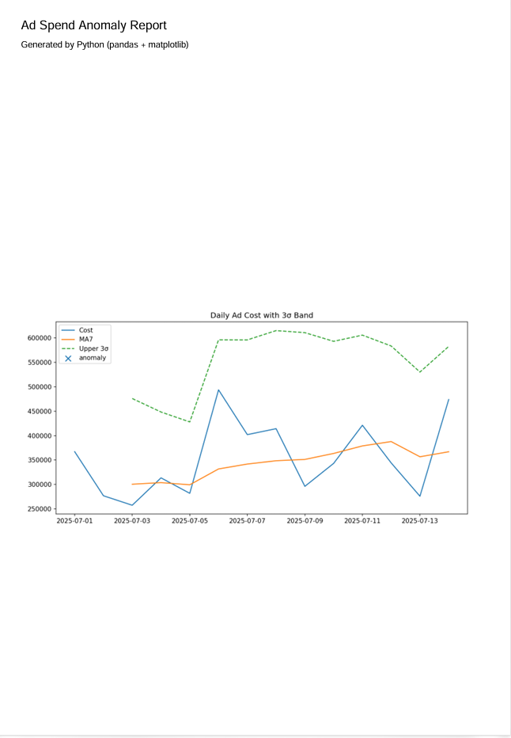

# LateBloomTech学習記録

これは、私（LateBloomTech）のPython、SQLの勉強の記録と、マネーフォワードからダウンロードしたCSVデータを、Python（Pandas）を使って分析するためのプロジェクトです。

## 機能
- 月々の支出トップ3を抽出します。
- 1万円以上の支出のピックアップ
- 大項目ごと合計金額を出して、多い順に並べて上位3つを表示
- 食費の合計
- 今後機能、学習過程、結果追加予定

## Project: Ad Spend Anomaly (Python + SQL)
- 問題: 広告コスト急騰の見逃し
- 解決: 7日移動平均+3σで異常検知 → PDFレポート出力
- Stack: Python(pandas/matplotlib), SQLite(SQL)
- # 
### Run
```bash
cd projects/ads-anomaly
python -m venv venv && .\venv\Scripts\activate
pip install -r requirements.txt
python src/prepare.py && python src/detect.py && python src/report.py

## 製作者
LateBloomTech